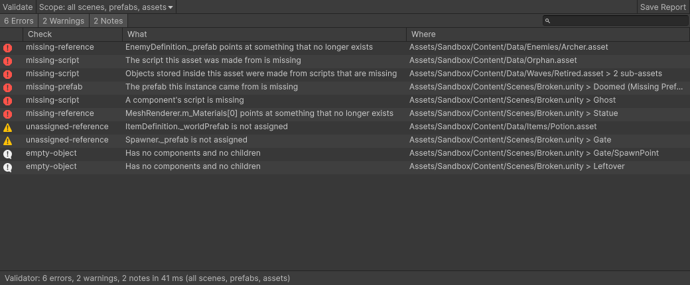
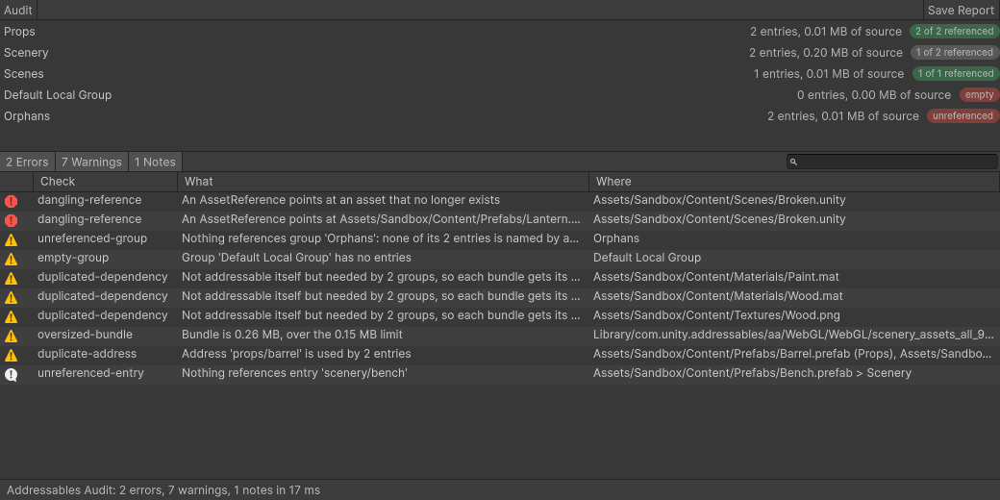
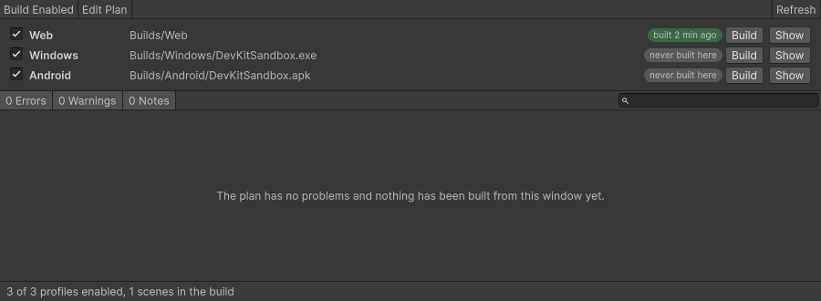
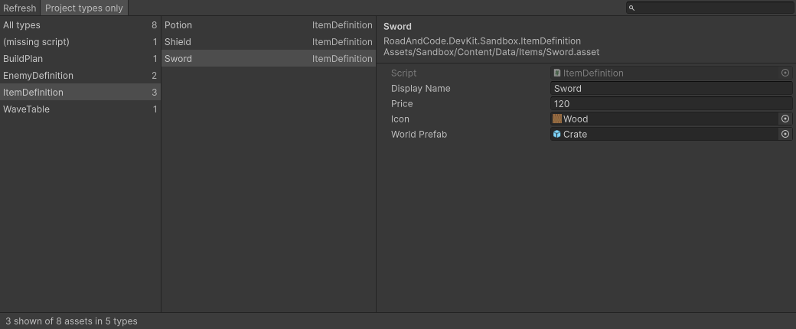
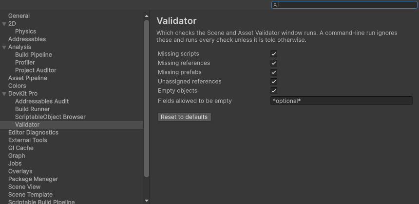

# DevKit Pro

Four Unity editor tools I kept rewriting in one project after another, pulled together into one package. Each has a window, a keyboard shortcut and a command-line entry point that writes a report and sets an exit code, so the same check runs on my machine and in a build script.

- **Package:** `com.roadandcode.devkit` 0.1.0, editor-only, no dependencies beyond Unity's own modules
- **Unity:** 6000.5 (built and tested on 6000.5.8f1, Windows)
- **Addressables:** optional. The audit is only compiled when the package is installed
- **Page with the write-up:** https://roadandcode.vercel.app/project.html?id=devkit-pro

## Overview

The repository is a small Unity project with the package embedded under `Packages/com.roadandcode.devkit`. Everything under `Assets/Sandbox` is a sample project broken on purpose: a scene with a missing script and dead references, an Addressables setup with a group nothing loads, a handful of ScriptableObjects. It is what the tests run against and what the screenshots below show.

## Tools

### Scene and Asset Validator



Reads scenes, prefabs, ScriptableObjects and materials and reports:

| Check | Severity | What it means |
| --- | --- | --- |
| `missing-script` | error | A component, an asset, or objects inside an asset, made from a script that is gone |
| `missing-reference` | error | A reference field that was set and now points at nothing |
| `missing-prefab` | error | An instance of a prefab that has been deleted |
| `unassigned-reference` | warning | A reference field on one of the project's own scripts that was left empty |
| `empty-object` | note | An object with no components and no children. Often a leftover, sometimes a marker |

The scope is a menu in the window: open scenes, the scenes in Build Settings, every scene, prefabs, assets. Scenes that are not open are opened additively, read and closed, so what you have open stays as it was. Fields that are allowed to be empty are named in the preferences (`*optional*` by default). Clicking a finding selects what it is about.

### Addressables Audit



The top half is every group at a glance: how many entries, how much source they pull in, how many of them anything references. Below it:

| Check | Severity | What it means |
| --- | --- | --- |
| `dangling-reference` | error | An `AssetReference` whose target is gone or is not addressable. Fails at run time, silently until then |
| `missing-asset` | error | An entry whose asset is gone (Addressables drops these by itself the next time it imports or builds) |
| `unreferenced-group` | warning | No entry in the group is named by an `AssetReference`, an address or a label, or needed by one that is |
| `unreferenced-entry` | note | The same for one entry inside a group that is otherwise used |
| `duplicated-dependency` | warning | An asset that is not addressable but is needed by entries in several groups, so each bundle gets a copy |
| `oversized-bundle` / `large-group` | warning / note | A built bundle over the size limit; without a build, the group's source files as an estimate |
| `duplicate-address` | warning | Two entries answering to one address |
| `empty-group` | warning | A group with no entries |
| `scene-in-build` | warning | A scene that is addressable and also in Build Settings |

"Referenced" is worked out from text: `AssetReference` and label fields in scenes, prefabs and assets, and every string literal in the project's runtime scripts. A name that only exists at run time (built by concatenation, downloaded) cannot be seen, so read "unreferenced" as "nothing I can find refers to it".

### Build Runner



A **Build Plan** asset lists the builds a project makes: a platform (Web, Windows, Android), an output path with `{product}`, `{version}`, `{platform}` and `{profile}` tokens, and the options that differ per platform: web compression with the decompression fallback, the Android app bundle switch, a development flag. The window builds one profile or all the enabled ones.

Before anything is built the plan is checked: no enabled scenes, a platform whose build support is not installed, two profiles writing to one place, an output inside `Assets`, an unknown token. Player settings a profile overrides are put back when the build ends, so building leaves no changes behind. The editor is switched to each platform before it is built, and the platform it is already on goes first.

### ScriptableObject Browser



Every ScriptableObject under `Assets`, grouped by type, found by the file's main type without loading it. Search matches name and path, and `t:Name` narrows by type. The filter hides types that come from Unity or installed packages. Selecting an asset shows its inspector in place; a double-click finds it in the Project window. Assets whose script is missing are listed under their own heading.

### Preferences and shortcuts



Each tool has a page under **Preferences > DevKit Pro**. The shortcuts are registered with the Shortcut Manager, so they can be changed under **Edit > Shortcuts**:

| Shortcut | Does |
| --- | --- |
| Alt+Shift+V | Validates the open scenes |
| Alt+Shift+B | Opens the Build Runner |
| Alt+Shift+G | Opens the Addressables Audit |
| Alt+Shift+O | Opens the ScriptableObject Browser |

## Install

**By Git URL.** In the Package Manager choose **Add package from git URL…** and enter:

```
https://github.com/roadandcode/devkit-pro.git?path=Packages/com.roadandcode.devkit#v0.1.0
```

or add the same line to `Packages/manifest.json`:

```json
"com.roadandcode.devkit": "https://github.com/roadandcode/devkit-pro.git?path=Packages/com.roadandcode.devkit#v0.1.0"
```

**From a `.unitypackage`.** Download `DevKitPro-0.1.0.unitypackage` from the [v0.1.0 release](https://github.com/roadandcode/devkit-pro/releases/tag/v0.1.0), then **Assets > Import Package > Custom Package…** and pick it. It keeps the package's own paths, so it lands in `Packages/com.roadandcode.devkit` as an embedded package and behaves exactly like the Git install. The tests are left out of it.

The tools are then under **Tools > DevKit Pro**.

## Command line

```
Unity -batchmode -projectPath <project> -executeMethod <entry point> [arguments]
```

| Entry point | Arguments |
| --- | --- |
| `RoadAndCode.DevKit.Validation.ValidatorCommand.Run` | `-devkitScope open,build,scenes,prefabs,assets,project,all` (default `project`: build scenes, prefabs, assets), `-devkitRules <ids>`, `-devkitOptionalFields <patterns>` |
| `RoadAndCode.DevKit.Builds.BuildCommand.Run` | `-devkitProfiles <names>` (default: every enabled profile), `-devkitPlan <asset path>` |
| `RoadAndCode.DevKit.AddressablesAudit.AuditCommand.Run` | `-devkitMaxBundleMb <number>` (default 10), `-devkitPackageAssets` |
| `RoadAndCode.DevKit.DataBrowser.CatalogCommand.Run` | `-devkitAllTypes`, `-devkitSubAssets` |

Every entry point also takes `-devkitReport <path>` (a `.json` path gets JSON, anything else plain text) and `-devkitFailOn error|warning|info|never` (default `error`). The process exits with `0` when nothing was at or above the threshold, `1` when something was (or a build failed), and `2` when the tool could not run.

A check that fails a build script on a broken scene:

```
Unity -batchmode -projectPath . -executeMethod RoadAndCode.DevKit.Validation.ValidatorCommand.Run -devkitScope all -devkitReport Logs/validator.json
```

A command-line run does not read the Preferences. Those belong to one person on one machine, and the same command has to give the same answer everywhere.

## What it found in my own projects

I installed the package by Git URL into copies of two of my projects and ran the three read-only tools from the command line. The originals were not touched.

| | Tactica AI | Plane Simulation |
| --- | --- | --- |
| Validator | 1 error, 2 notes | 1 error, 18 notes |
| Addressables Audit | 1 warning | clean |
| ScriptableObjects, sub-assets included | 35 in 11 types | 12 in 8 types |

- **The error is the same in both, and it is Unity's.** The default volume profile that comes with the URP project template carries nine components made from Unity's own test scripts, which are in no project. They do no harm; I did not know they were there.
- **The notes are markers.** Two empty parents the board fills at run time, and the sockets on the jet's model. That is why an empty object is a note and not a warning.
- **The warning is an empty `Default Local Group`** in Tactica AI, left over from when Addressables was set up.
- Neither project has a reference field left empty on its own scripts, or a missing reference. Both already check their references when their content is built, so that was the expected answer.

Scan times and the rest of the numbers are in [docs/performance.md](docs/performance.md).

## Architecture

One assembly per tool, all editor-only, and none of them references another. Inside a tool, the analysis is plain C# that takes project data in as records and returns findings as data; adapters read the project through the editor API; the window is a thin view over a presenter. That split is what lets the rules and the windows' behaviour be tested on hand-made records and fake views, with no project to read. There is no DI container and no dependency on my runtime packages: each tool has one composition class that names the concrete types, and everything else gets what it needs through its constructor.

The module map, the dependency rules and the reasons behind them are in [docs/architecture.md](docs/architecture.md).

## Tech stack

- Unity 6000.5.8f1, C#, UI Toolkit for every window and preference page
- `SettingsProvider` for preferences, the Shortcut Manager for shortcuts
- Unity Test Framework: 224 EditMode tests (194 in the package, 30 that run the tools against the sample project)
- Addressables 4.1.1 in the sandbox, read through a separate assembly behind a version define

## Working on it

Open the repository as a Unity project. The package is at `Packages/com.roadandcode.devkit`.

```
# every test
Unity -batchmode -projectPath . -runTests -testPlatform EditMode -testResults Logs/editmode.xml

# rebuild the sample content from nothing (regenerates every asset under Assets/Sandbox/Content)
Unity -batchmode -quit -projectPath . -executeMethod RoadAndCode.DevKit.Sandbox.Editor.SandboxContent.BuildAll

# retake the screenshots (needs a normal editor on a display, so no -batchmode)
Unity -projectPath . -executeMethod RoadAndCode.DevKit.Sandbox.Editor.Screenshots.CaptureAll

# write Builds/DevKitPro-<version>.unitypackage
Unity -batchmode -quit -projectPath . -executeMethod RoadAndCode.DevKit.Sandbox.Editor.PackageExport.Export
```

## What I learned

- **`BuildPlayer` will build a platform the editor is not on, and Addressables will not follow it.** My first web build from a Windows editor finished with a success message, the right size and a catalog with no bundles behind it. The Build Runner now switches platform first. I only saw it because I opened the output folder instead of trusting the summary.
- **Addressables tidies up after you without saying so.** I planted an entry for a deleted asset to test a check, and it was gone the next time the project opened. No error, no failed build. The thing that stays broken is the `AssetReference` that pointed at it, so that is what the audit reports now.
- **Sample data is not real data.** The validator's first run on a real project reported sixteen errors. Nine were true and one line would have said it better; seven were references under a field URP has marked obsolete. Both changed the tool.
- **A path from Unity is not always a Unity path.** One Addressables property returns its folder with a backslash on Windows. Until I normalised it the audit read the group files as references and declared everything used.
- **A window's presenter is worth the extra type.** Editor windows cannot be opened in batch mode, so everything a window does that is not drawing lives in a class a test can drive with a fake view.

## Limits

- Built and tested on Unity 6000.5.8f1 on Windows only. The package says 6000.5 for that reason; it uses one API (`SerializedProperty.objectReferenceEntityIdValue`) that older versions may not have.
- The Build Runner has made web builds of the sample project, checked in a browser. Windows and Android profiles go through the same code and are covered by tests with a fake builder, but I have not built either with it yet.
- The tools read `Assets`. Content inside embedded packages is not scanned.
- The audit's idea of "referenced" is text matching, as described above.
- The windows are driven through their presenters in tests and were opened by a script for the screenshots. The shortcuts are tested for being registered and for not clashing with another binding; the keys themselves have not been pressed in a test.

## License

MIT. See [LICENSE](LICENSE).
